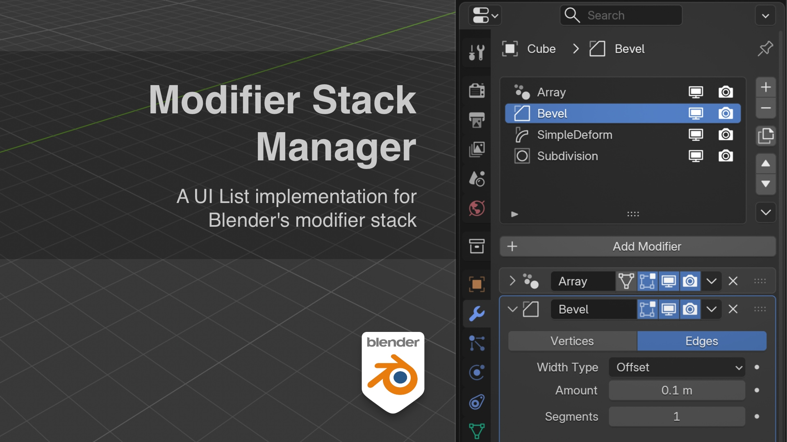

# Modifier Stack Manager

A modifier stack manager for Blender.

This addon implements a UI List for the modifier stack similar to the ones used to manage Materials, UV Maps, Vertex Groups, etc.

The addon enables you to do the following actions directly from the list:

  - Add/Remove Modifiers
  - Duplicate Modifiers
  - Rearrange Modifiers
  - Rename Modifiers
  - Toggle Render/Viewport Visibility
  - Apply/Apply All Modifiers
