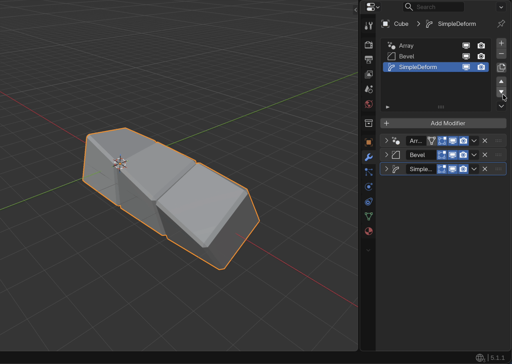
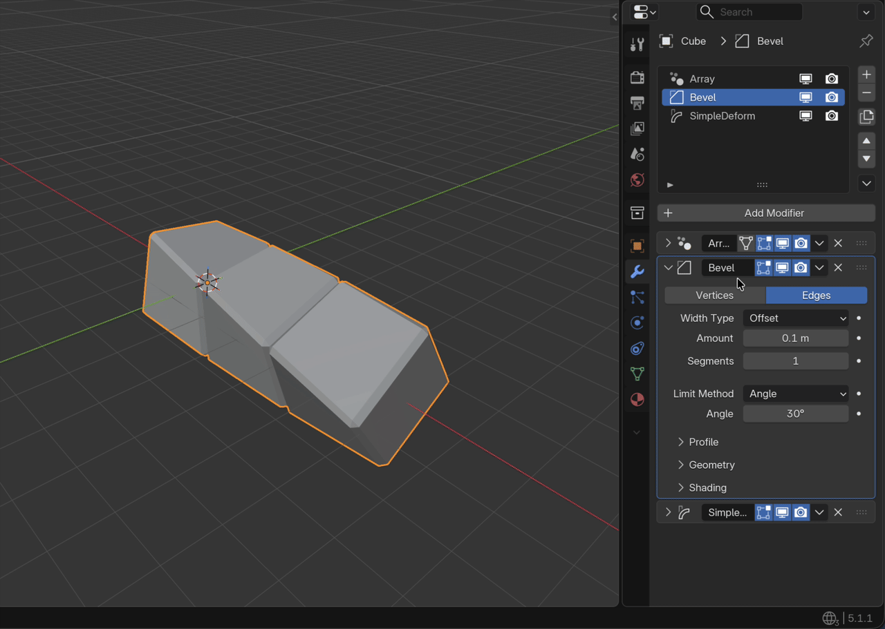
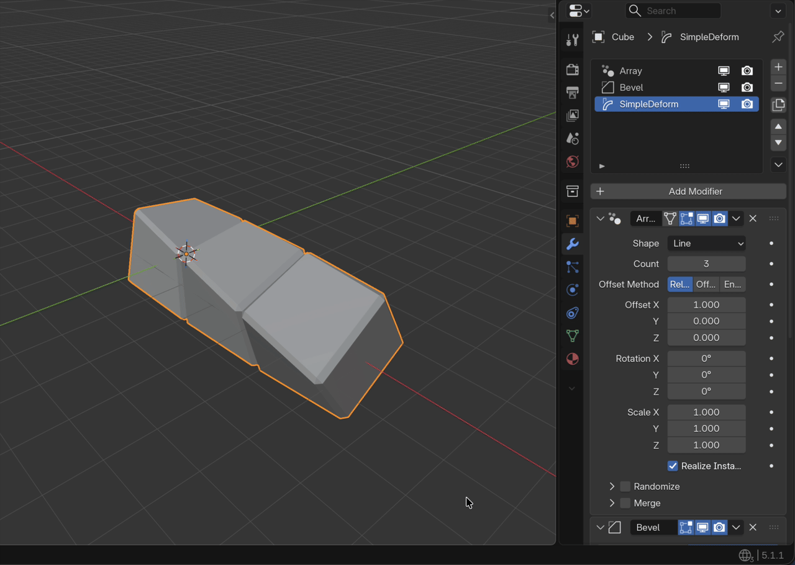
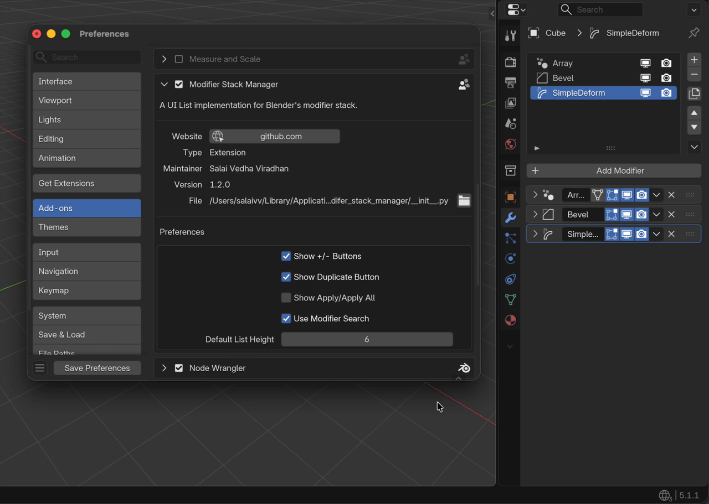
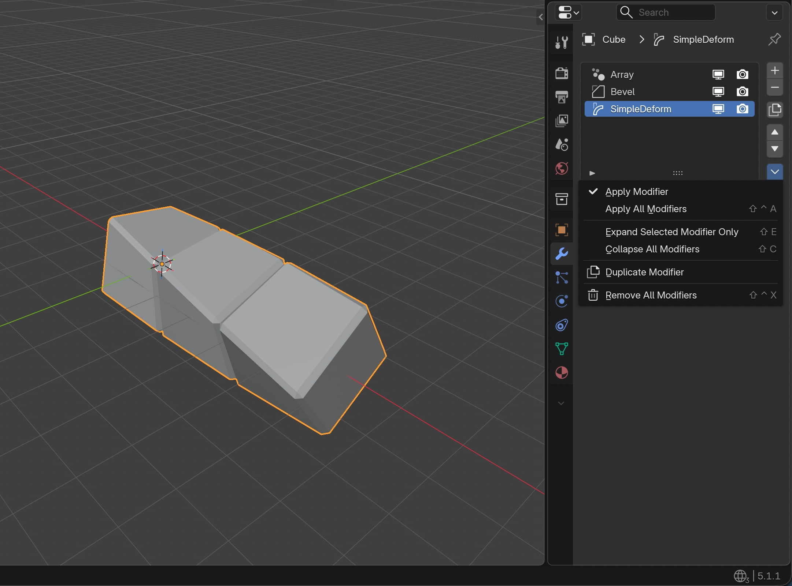

# Modifier Stack Manager

A modifier stack manager for Blender.

This addon implements a UI List for the modifier stack similar to the ones used to manage Materials, UV Maps, Vertex Groups, etc.

The addon enables you to do the following actions directly from the list:

  - Add/Remove Modifiers
  - Duplicate Modifiers
  - Rearrange Modifiers
  - Rename Modifiers
  - Toggle Render/Viewport Visibility
  - Apply/Apply All Modifiers
  - Remove All Modifiers
  - Expand selected modifier and collapse the rest
  - Collapse All Modifiers

## Feature Showcase

Move modifiers up/down using __Ctrl + Shift + Up/Down Arrow__ hotkey:

Move a modifier to the beginning or the end of the stack by holding down the __Shift__ key and pressing the Up/Down buttons in the UI:

Expand the selected modifier and collapse the rest using __Shift + E__ hotkey:

Collapse all modifiers using the __Shift + C__ hotkey:

Enable/disable parts of the addon's UI from the addon preferences:

Certain operators can be accessed from the dropdown menu as well:

## Hotkeys

- __Ctrl + Shift + A__: Apply all modifiers. 
- __Ctrl + Shift + X__: Remove all modifiers. 
- __Shift + E__: Expand the selected modifier and collapse the rest.
- __Shift + C__: Collapse all modifers.
- __Ctrl + Shift + Up/Down Arrow__: Move the selected modifier up/down. 
- __Shift__: Hold while pressing the Up/Down buttons (on the right of the list; not the arrow keys) to move the modifier to the beginning or the end respectively.

NOTE: All hotkeys are usable only when hovering over the *Modifiers* tab in the *Properties* window unless otherwise mentioned.

## Development

1. Clone this repository.
2. Create a new blend file named `testing.blend` in the repo's root directory.
3. Copy the code in `testing.py` to the Text Editor in `testing.blend`.
4. As you make changes to the code, press the _Run Script_ ▶️ button in the Text Editor to build and reinstall the addon.

NOTE: If you have the addon previously installed from the [Extensions Platform](https://extensions.blender.org/add-ons/modifer-stack-manager/), temporarily uninstall it during development.

## Limitations

Currently the sync between the active modifier on the list and the stack is one way only. That is, when you click on a modifier on the list, it makes the corresposing modifier on the stack active. But this does not work the other way around.